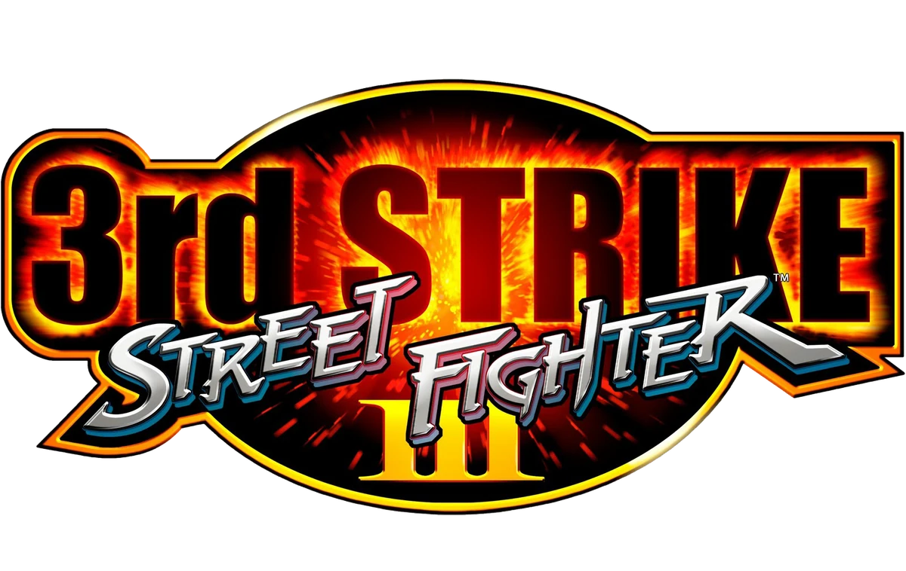

# sfiii-decomp

A work-in-progress decompilation of Street Fighter III: 3rd Strike for PlayStation 2.

The project aims to recreate the source code from the existing binaries which would allow to port the game to current platforms, preserve the game for future generations of fighting game players and to improve and expand upon the game.

## Decomp progress

<!-- PROGRESS-TABLE:START -->
| Module   | Progress (size)   | Progress (func count)   | Notes                                                                                          |
|----------|-------------------|-------------------------|------------------------------------------------------------------------------------------------|
| sf33rd   | 28.10%            | 30.38%                  | Game functions.                                                                                |
| cri      | 73.04%            | 80.36%                  | CRI Middleware functions. For a full list of functions see [cri-progress.md](cri-progress.md). |
<!-- PROGRESS-TABLE:END -->

## Where to start

Visit [the Wiki](https://github.com/apstygo/sfiii-decomp/wiki) for instructions on how to [build](https://github.com/apstygo/sfiii-decomp/wiki/Building) and [decompile](https://github.com/apstygo/sfiii-decomp/wiki/Decompiling) and other useful resources.

## Community

Join `PS1/PS2 Decompilation` server on Discord to discuss the project and ask questions on the dedicated `sf3-third-strike` channel!

